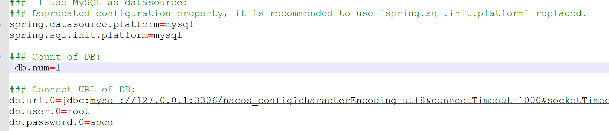
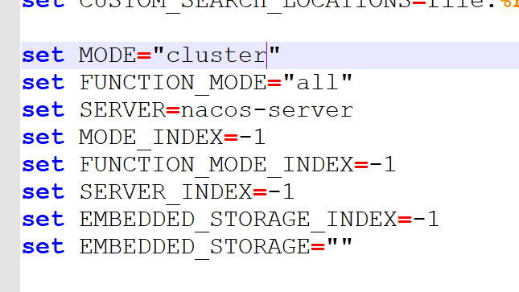
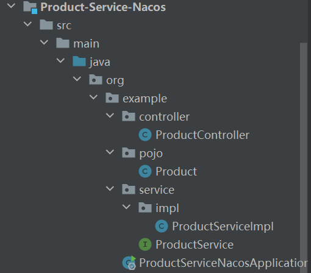
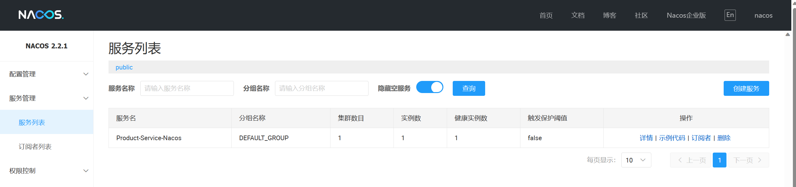
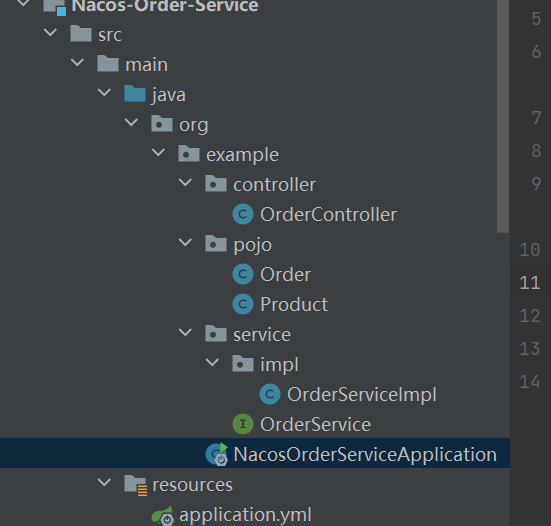
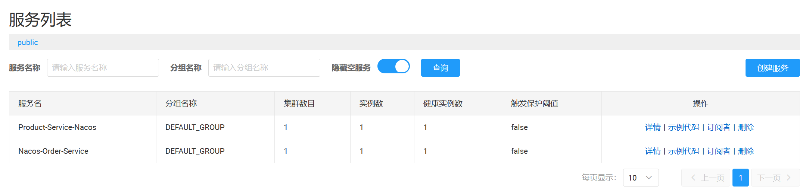
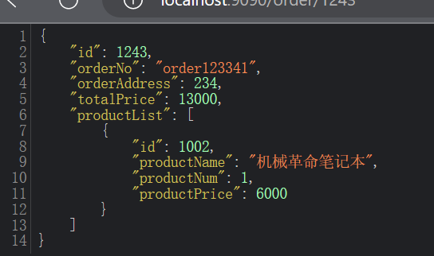
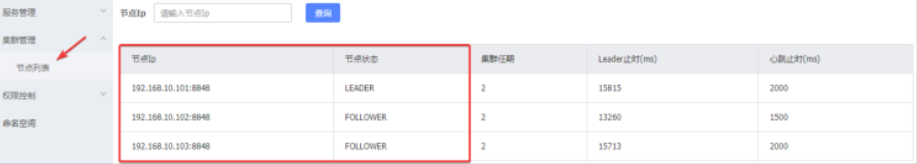

### Nacos注册中心

#### 安装Nacos在Windows系统 
- 下载 nacos.zip 
- 解压压缩包
- 创建数据库，（执行nacos 给定的sql文件(压缩包自带)）
  - 执行sql文件前，创建数据库
- 修改配置文件 application.properties
- 修改启动模式（standalone、cluster）
- 以standalone 模式启动 nacos



#### nacos 相关配置
##### nacos服务端 ip 地址修改：
> 修改application.properties 中的 nacos.inetutils.ip-address 属性

---
注意 在Nacos 2.2.0.1 以后的版本 
nacos.core.auth.plugin.nacos.token.secret.key 无默认值。需要自己设置
---
#### 服务注册与发现 (Nacos 作为注册中心)
##### 服务注册 Product-service 注册到 nacos
Product-service 模块

使用 @EnableDiscoveryClient 开启服务注册、发现功能

服务注册到 nacos中：


##### 服务发现
Nacos-Order-Service 模块


Nacos 获取服务
```java
  private List<Product> selectProductList(){
      StringBuffer sb = new StringBuffer();
      //获取服务列表
      List<String> services = discoveryClient.getServices();
      if (services == null || services.get(0)== null){
          return null;
      }
      //根据服务名获取服务
      List<ServiceInstance> instances = discoveryClient.getInstances("Product-Service-Nacos");
      if (instances == null || instances.get(0)== null){
          return null;
      }
      //构建远程调用服务
      ServiceInstance serviceInstance = instances.get(0);
      sb.append("http://"+serviceInstance.getHost()+":"+serviceInstance.getPort()+"/product/1002");
      ResponseEntity<List<Product>> exchange = restTemplate.exchange(
              sb.toString(),
              HttpMethod.GET,
              null,
              new ParameterizedTypeReference<List<Product>>() {
              });
      return exchange.getBody();
  }
```


#### nacos 集群
客户端配置文件:application.yml
```yml
spring:
  cloud:
    nacos:
      discovery:
        enabled: true #使用nacos进行服务注册、配置
        server-addr: 192.168.10.101,192.168.10.102,192.168.10.103
```
nacos 配置文件修改,修改三个nacos 的conf 下的cluster文件
添加以下格式的数据: ip:port
192.168.10.101:8848
192.168.10.102:8848
192.168.10.103:8848

- 去修改nacos 的ip地址：
  - 配置文件下的nacos.inetutils.ip-address属性
- 分布以 cluster 模式启动nacos


